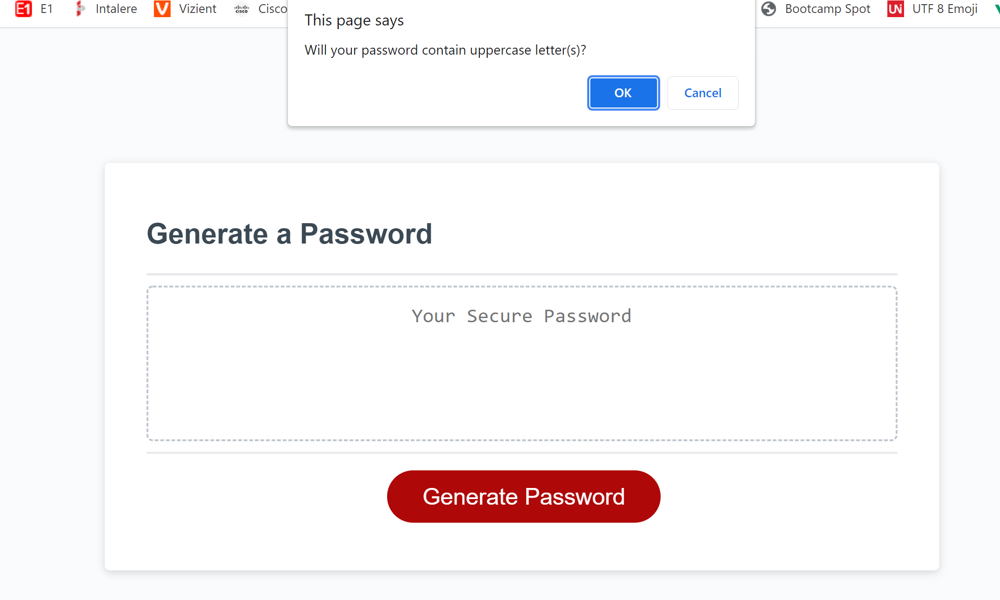

# Homework-week-3
Password generator using JAVASCRIPT

## TASK
MODIFY STARTER CODE TO CREATE APPLICATION THAT GENERATES RANDOM PASSWORD BASED ON CRITERIA THAT USER HAS SELECTED (USING JAVASCRIPT).

## User Story

AS AN employee with access to sensitive data
I WANT to randomly generate a password that meets certain criteria
SO THAT I can create a strong password that provides greater security

## Acceptance Criteria

GIVEN I need a new, secure password
WHEN I click the button to generate a password
THEN I am presented with a series of prompts for password criteria
WHEN prompted for password criteria
THEN I select which criteria to include in the password
WHEN prompted for the length of the password
THEN I choose a length of at least 8 characters and no more than 128 characters
WHEN asked for character types to include in the password
THEN I confirm whether or not to include lowercase, uppercase, numeric, and/or special characters
WHEN I answer each prompt
THEN my input should be validated and at least one character type should be selected
WHEN all prompts are answered
THEN a password is generated that matches the selected criteria
WHEN the password is generated
THEN the password is either displayed in an alert or written to the page

## SCREENSHOTS:
A PASSWORD GENERATOR APPLICATION DISPLAYS A RED BUTTON TO "GENERATE PASSWORD"

A PROMPT POPS UP TO ASK THE USER HOW MANY CHARACTERS THEY WOULD LIKE IN THEIR PASSWORD.

A CONFIRM BOX POPS UP TO ASK IF THE USER WOULD LIKE TO USE UPPERCASE LETTERS.

A CONFIRM BOX POPS UP TO ASK IF THE USER WOULD LIKE TO USE LOWERCASE LETTERS.

A CONFIRM BOX POPS UP TO ASK IF THE USER WOULD LIKE TO USE NUMBERS.

A CONFIRM BOX POPS UP TO ASK IF THE USER WOULD LIKE TO USE SPECIAL CHARACTERS.

A RANDOM PASSWORD IS THEN GENERATED BASED ON THE USERS ANSWERS AND DISPLAYED.

## LINK TO DEPLOYED APPLICATION:

https://bripap.github.io/password-generator/
